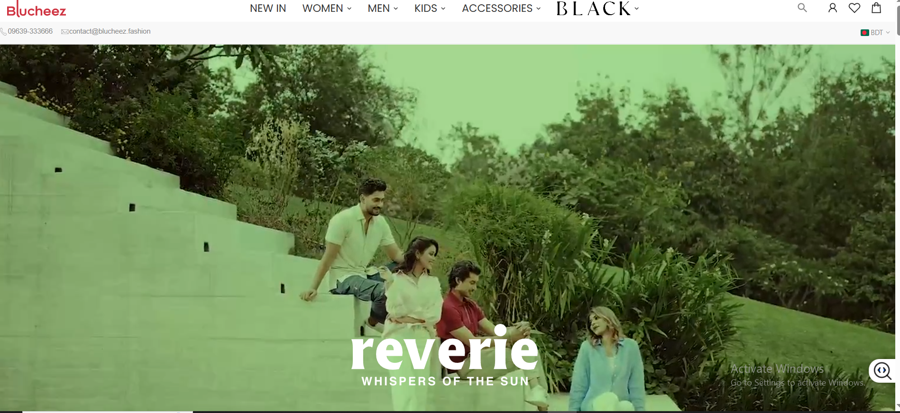
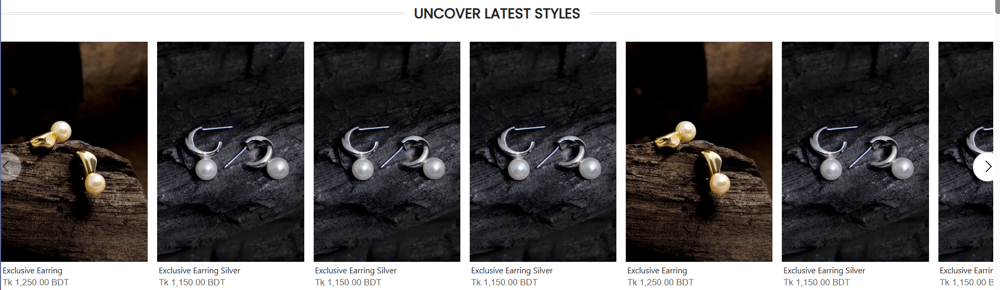
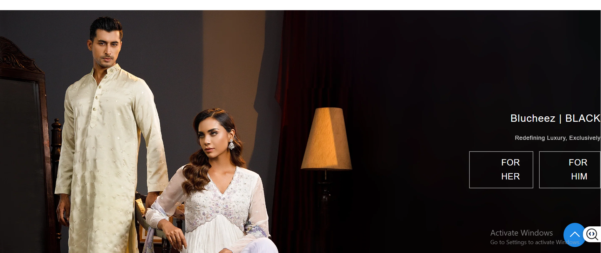
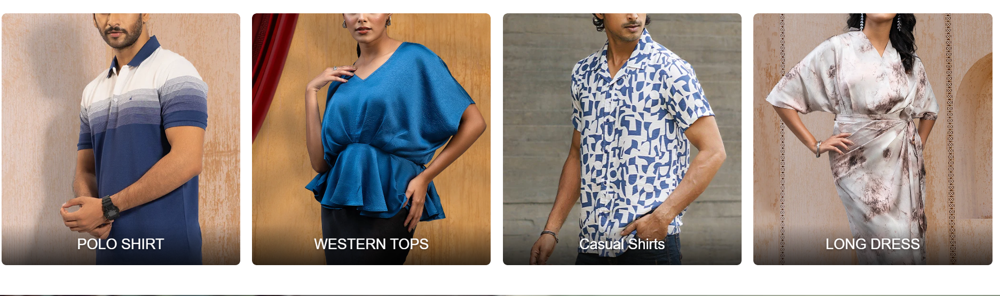
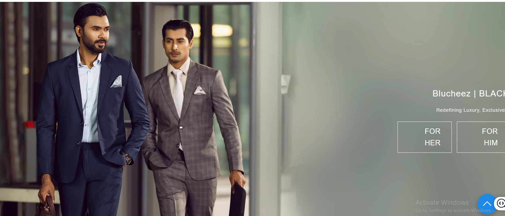
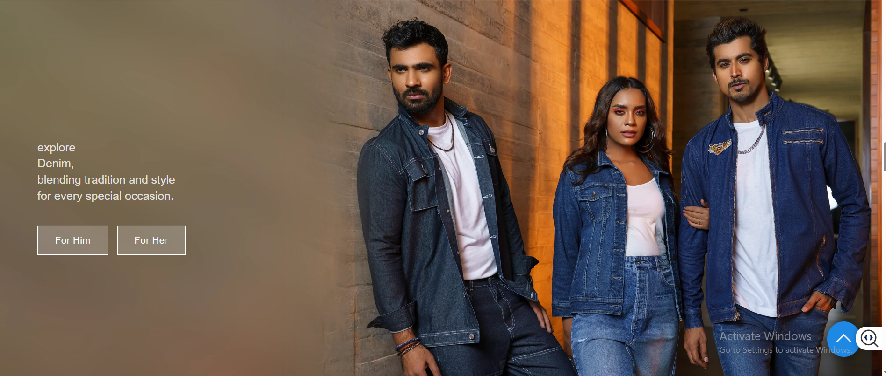
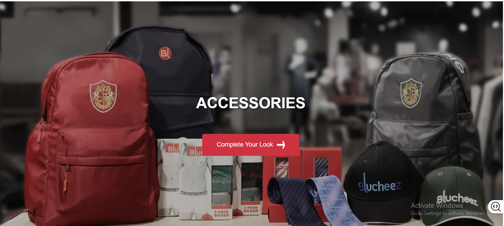
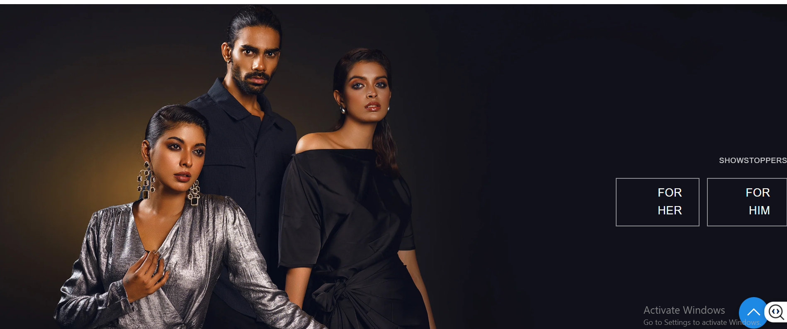

# 🛍️ Retail ERP & E-commerce Platform

**A comprehensive, scalable, and modern solution for managing retail operations and driving online sales.**

---

## ✨ Project Overview

This project delivers a full-stack Enterprise Resource Planning (ERP) system tightly integrated with a responsive e-commerce storefront. Designed with a microservices-inspired architecture (CQRS, Clean Architecture) and deployed on cutting-edge cloud infrastructure (AWS Lambda for API, likely frontend hosting), it aims to provide businesses with powerful tools for:

* **Product Management:** Seamlessly manage product catalogs, inventory, and details.
* **Order Processing:** Efficiently handle customer orders from discovery to fulfillment.
* **User & Authentication:** Secure user management with robust authentication.
* **Scalability:** Built to handle fluctuating loads and grow with your business.
* **Modern User Experience:** Intuitive and engaging interfaces for both customers and administrators.

---

## 🚀 Key Features

* **Robust E-commerce Frontend:** A user-friendly online store for product Browse, search, and secure purchasing.
* **Comprehensive Backend API:** A powerful and scalable API providing full CRUD operations for product, inventory, order, and user data.
* **Cloud-Native Architecture:** Leveraging serverless compute (AWS Lambda for API) for cost-efficiency and auto-scaling.
* **CQRS & Clean Architecture:** Ensuring maintainability, testability, and clear separation of concerns.
* **Secure Authentication:** JWT-based authentication for both API and frontend.
* **File Management:** Integrated solution for handling product images and other assets.

---

## 🎥 Video Demo & 📸 Screenshots

Witness the platform in action with our comprehensive video demo, followed by detailed screenshots of key features.

---

### Full System Walkthrough Video

**For the best viewing experience, please click the image below to watch the full video demo hosted externally.**
(Alternatively, you can [download the video directly here](Screenshots/videoformarketing.mkv).)

[](YOUR_YOUTUBE_OR_VIMEO_LINK_HERE)

*(**Note:** Replace `YOUR_YOUTUBE_OR_VIMEO_LINK_HERE` with the actual URL of your video after you upload it to a platform like YouTube. You should also create a small `video_thumbnail_placeholder.png` image (e.g., a still from your video with a "Play" button) and put it in your `Screenshots` folder for a better visual preview.)*

---

### Detailed Feature Screenshots

Explore the power and elegance of our platform through these visual showcases:

---

#### 1. Engaging Homepage & Product Discovery

Our intuitive homepage immediately draws customers in, highlighting featured products and easy navigation.



---

#### 2. Streamlined Product Browse & Categorization

Navigate effortlessly through diverse product categories and discover detailed product listings.



---

#### 3. Detailed Product Views

Get a closer look at each product with rich descriptions, pricing, and clear calls to action.



---

#### 4. Advanced Product Search & Filtering

Effortlessly find desired items with powerful search capabilities and intelligent filtering options.


---

#### 5. Secure Shopping Cart & Checkout Process

A smooth, multi-step checkout ensures a seamless purchasing experience for customers.



---

#### 6. Order Confirmation & Tracking

Customers receive clear confirmations and can easily track the status of their orders.



---

#### 7. User Authentication & Profile Management

Secure login, registration, and user profile management for personalized experiences.



---

#### 8. Backend / Admin Dashboard Overview

A glimpse into the administrative interface for managing products, orders, and users.


---

#### 9. Product Management Interface (Admin)

Efficiently add, update, and manage your product catalog from the backend.



---

#### 10. Website Integration & Analytics (High-Level)

Showcasing how the different parts of the website come together, possibly with some basic analytics or site structure.



---

## 🛠️ Technologies Used

**Backend (API):**
* ASP.NET Core Web API (C#)
* mvc pattern
* Clean Architecture Principles
* Entity Framework Core (for ORM)
* PostgreSQL (Database)
* JWT Authentication
* AWS Lambda (Serverless Compute)
* AWS API Gateway
* AWS S3 (for file storage like images)
* Serilog (Logging)
* FluentValidation (Request Validation)
* AutoMapper (Object Mapping)

**Frontend:**
* react.js (JavaScript Framework)
* HTML5, CSS3
* Bootstrap / AdminLTE (UI Frameworks)
* Axios (HTTP Client)

---

## 📦 Getting Started

### Prerequisites

* [.NET SDK 9.0 (or compatible version)](https://dotnet.microsoft.com/download/dotnet/)
* [Node.js & npm](https://nodejs.org/en/download/)
* [sqlserver](https://sqlserver/download/) (running locally or accessible)
* [AWS CLI](https://aws.amazon.com/cli/) (for Lambda deployment, if applicable)
* [Git](https://git-scm.com/downloads)

### Installation & Setup

1.  **Clone the repository:**
    ```bash
    git clone [https://github.com//kashimmirza/ecommerce.git](https://github.com/your-username/ecommerce.git)
    cd ecommerce
    ```

2.  **Backend Setup (`ApiOnLambda`):**
    * Navigate to the backend project: `cd ApiOnLambda`
    * Install dependencies: `dotnet restore`
    * Configure `appsettings.json` with your database connection string, JWT settings, and AWS S3 bucket details.
    * Run database migrations: `dotnet ef database update` (if using EF Core migrations)
    * Build the project: `dotnet build`
    * **To run locally:** `dotnet run` (or deploy to AWS Lambda as per your deployment guide)

3.  **Frontend Setup (`frontend`):**
    * Navigate to the frontend project: `cd frontend`
    * Install dependencies: `npm install` (or `yarn install`)
    * Configure API endpoint in `.env` file (e.g., `VUE_APP_API_API_URL=http://localhost:XXXXX/api/` or your deployed API Gateway URL).
    * Run the development server: `npm run serve` (or `yarn serve`)

### Accessing the Application

* **Frontend:** Typically accessible at `http://localhost:8080` (or the port specified by `npm run serve`).
* **Backend (Swagger UI):** If running locally, usually at `https://localhost:XXXXX/swagger` (replace `XXXXX` with your API's port).

---

## 🤝 Contributing

We welcome contributions! Please see `CONTRIBUTING.md` (if you plan to create one) for details.

---

## 📄 License

This project is licensed under the [MIT License](LICENSE) - see the `LICENSE` file for details.

---

## 📞 Contact

[md abul kashim/nerd community] - [kashimmirza86@gmail.com/whatsapp: +8801782669276] - [https://www.linkedin.com/in/abul-kashim1998/]

---